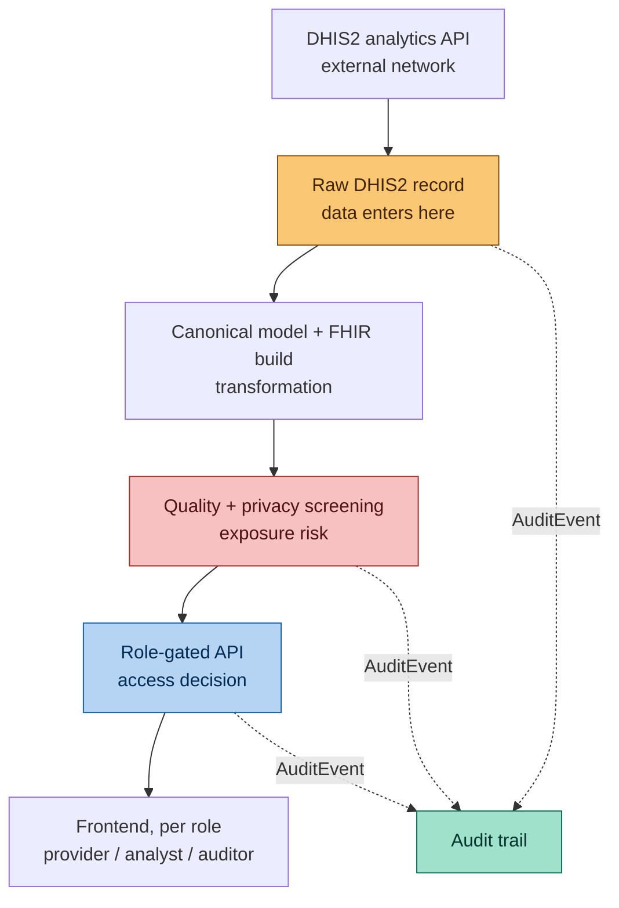

# Data Mediation Layer

A secure data mediation layer for cross-organisation health data access, focused on supporting Universal Health Coverage (UHC) analysis in Sierra Leone.

## Problem

Health data needed for UHC analysis can come from different organisations and systems. In this project, we work with:

- DHIS2 for aggregate health service activity data
- Statistics Sierra Leone for district population data

These sources have different data structures and formats, making it difficult to use them together directly.

The data also needs to be assessed before it can be shared. This includes checking its quality, privacy risks, semantic meaning, and compliance with a standard such as FHIR. Different users also need different levels of access, and their actions need to be traceable.

## Solution

A pipeline that takes raw source data through acquisition → canonical modelling →
quality/privacy screening → standards-based (FHIR R4) export, with role-based access
control and an audit trail at every step:

1. **Acquire** aggregate indicators from the Sierra Leone DHIS2 demo instance, unmodified
   ([`docs/rbac.md`](docs/rbac.md) covers who can read raw records).
2. **Transform** into a canonical model (District/Indicator/Observation) plus
   self-describing governance metadata per dataset (`DataProduct`).
3. **Integrate a second source** — 2021 census district population — reconciled against
   DHIS2's district boundaries, to derive a UHC-relevant metric (service activity as a
   share of population) that neither source provides alone
   ([`docs/population-integration.md`](docs/population-integration.md)).
4. **Assess quality and privacy** automatically: completeness, validity, outliers,
   staleness, identifier leakage, small-cell disclosure risk — resolved into a visible
   `publishable` / `publishable_with_warnings` / `blocked` decision that always requires a
   human governance sign-off
   ([`docs/data-quality.md`](docs/data-quality.md), [`docs/privacy.md`](docs/privacy.md)).
5. **Map to a recognised terminology** (ICD-10), proposal separated from
   human-reviewed acceptance ([`docs/terminology-mapping.md`](docs/terminology-mapping.md)).
6. **Export as real FHIR R4 resources**, validated against a self-hosted HAPI FHIR
   server — not just resources that "look like" FHIR.
7. **Gate every read behind a role** (data provider / analyst / auditor) and **record
   every security-relevant action** (auth, access-denied, acquire/transform/validate/
   publish, view/download, admin changes) as an audit trail, kept separate from data
   _lineage_ (`Provenance`) ([`docs/rbac.md`](docs/rbac.md), [`docs/audit.md`](docs/audit.md)).

No real patient data exists anywhere in this system — everything traces back to DHIS2's
public demo instance or a published census total. See [`docs/privacy.md`](docs/privacy.md)
for what that does and doesn't mean for privacy risk.

## Architecture

Text form, for anyone viewing this outside a Mermaid-capable renderer:

```
DHIS2 demo API ──┐                                      ┌── HAPI FHIR R4 validator
                  ▼                                      ▼
        apps.dhis2 (raw, unmodified) ──► apps.data_products (canonical + governance)
                                                │              ▲
2021 census CSV ──► apps.population ───────────┘              │
                                                                │
                        apps.terminology (ICD-10 mapping) ─────┘
                                                │
                                          apps.fhir (build + validate + export)

apps.accounts   — JWT auth + role (Group) based authorisation, every app above
apps.audit      — AuditEvent (access/security) + ProvenanceRecord (lineage), cross-cutting
```

| Layer           | Stack                                                                                    |
| --------------- | ---------------------------------------------------------------------------------------- |
| Backend         | Django 5 + Django REST Framework, PostgreSQL, JWT auth (`djangorestframework-simplejwt`) |
| Frontend        | Next.js 14 (App Router) + TypeScript + Tailwind, SWR for data fetching                   |
| FHIR conformity | Self-hosted HAPI FHIR R4 JPA server (`$validate` operation)                              |
| Orchestration   | `docker-compose` — `db`, `backend`, `frontend`, `fhir-validator`                         |

Backend apps, each documented where the interesting logic is:

| App                  | Responsibility                                                                                          |
| -------------------- | ------------------------------------------------------------------------------------------------------- |
| `apps.accounts`      | Roles (`data_provider`/`analyst`/`auditor`) as Django Groups, `HasAnyRole` permission, `/api/auth/me/`. |
| `apps.dhis2`         | DHIS2 client + raw record storage/acquisition.                                                          |
| `apps.data_products` | Canonical model, `DataProduct` governance metadata, data-quality/privacy checks.                        |
| `apps.population`    | Second-source (census) integration, district reconciliation, service-coverage metric.                   |
| `apps.terminology`   | ICD-10 mapping proposal/review.                                                                         |
| `apps.fhir`          | FHIR R4 resource building + real conformity validation.                                                 |
| `apps.audit`         | `AuditEvent`/`ProvenanceRecord`, append-only, auditor-gated API.                                        |

## Data flow and trust boundaries



- **Amber** — where data enters the system (`apps.dhis2`, unauthenticated external source, treated as untrusted until screened).
- **Red** — where sensitive information could be exposed: small-cell disclosure risk and identifier leakage are screened here (`apps.data_products`, see [`docs/privacy.md`](docs/privacy.md)), before anything is marked publishable.
- **Blue** — where access decisions are enforced: `apps.accounts`' `HasAnyRole` permission gates every read by role (data provider / analyst / auditor).
- **Teal** — where audit evidence is produced: `apps.audit` receives `AuditEvent` entries from ingestion, screening, and the API layer independently, rather than one central logger guessing at what happened upstream. `ProvenanceRecord` (data lineage — how a resource came to be) is tracked separately from `AuditEvent` (security/access events) — see [`docs/audit.md`](docs/audit.md) for the distinction.

## Quick start

Requires Docker and Docker Compose.

```bash
cp .env.example .env        # fill in SECRET_KEY, DB creds, etc. — see comments in the file
docker compose up --build
```

This starts Postgres, the FHIR validator (~40s to become ready), the Django backend on
`localhost:8000`, and the Next.js frontend on `localhost:3000`.

Then, in a second terminal, set up the database and pull/build the demo data:

```bash
docker compose exec backend python manage.py migrate      # also seeds the three role Groups
docker compose exec backend python manage.py createsuperuser

# Pipeline, in order:
docker compose exec backend python manage.py fetch_dhis2_data       # FR1: acquire
docker compose exec backend python manage.py transform_to_canonical # FR2/FR6.6/FR6.7: canonicalise + assess
docker compose exec backend python manage.py import_population      # FR6.5: second source
docker compose exec backend python manage.py create_uhc_coverage_product
docker compose exec backend python manage.py propose_terminology_mappings   # FR6.4: propose (review via /admin/)
docker compose exec backend python manage.py export_fhir            # FR6.3: build + validate + export
```

Log in to `http://localhost:8000/admin/` with the superuser to assign roles (Users →
select a user → Groups) and review/approve governance decisions (data-product
sensitivity classification, terminology mapping status). Log in to
`http://localhost:3000` with any user that has a role assigned to use the app itself.

## Testing

Backend (148 tests as of this writing, covering permissions, quality/privacy checks,
FHIR conformity, terminology enforcement, and the audit trail):

```bash
docker compose exec backend python manage.py test
```

Frontend type-check and production build:

```bash
docker compose exec frontend npx tsc --noEmit
docker compose exec frontend npm run build
```

Per-area test commands and what they specifically prove are documented in each
`docs/*.md` file's own "Running the tests that prove this" section.

## Documentation

| Doc                                                                | Covers                                                                                                |
| ------------------------------------------------------------------ | ----------------------------------------------------------------------------------------------------- |
| [`docs/rbac.md`](docs/rbac.md)                                     | Roles, endpoint → role matrix, known limitation (role-based, not org-scoped).                         |
| [`docs/audit.md`](docs/audit.md)                                   | AuditEvent vs. Provenance, what's logged, access control, immutability.                               |
| [`docs/data-quality.md`](docs/data-quality.md)                     | The FR6.6 checks and the publish/blocked decision rule.                                               |
| [`docs/privacy.md`](docs/privacy.md)                               | Sensitivity classification, identifier detection, small-cell suppression, GDPR/HIPAA self-assessment. |
| [`docs/terminology-mapping.md`](docs/terminology-mapping.md)       | ICD-10 mapping, propose/review separation.                                                            |
| [`docs/population-integration.md`](docs/population-integration.md) | Second-source integration, district reconciliation, service-coverage metric.                          |

## Known limitations

- **Role-based, not organisation-scoped.** No Organisation/tenant model exists yet — a
  `data_provider` sees all raw records, not only their own org's, and `AuditEvent.
organisation` is consequently left blank. See [`docs/rbac.md`](docs/rbac.md) and
  [`docs/audit.md`](docs/audit.md).
- **No retention/deletion policy** for raw records, canonical observations, or audit/
  provenance rows.
- **No encryption in transit between compose services** (no TLS configured locally) and
  no secrets manager beyond `.env`.
- **The PII free-text scanner is regex-based and English-oriented** — a net, not a
  guarantee (`docs/privacy.md`).
- **`permitted_audience` is stored but not enforced** at the query layer yet.
- **Not every admin form is audited** — governance edits to `DataProduct` and
  `TerminologyMapping` are, role/Group assignment via the stock Django `UserAdmin` is not
  (`docs/audit.md`).
- This is a prototype against DHIS2's public **demo** instance and a **2021** census
  extract — no real patient data, and the demo instance's synthetic recent periods
  genuinely trigger some of the staleness/out-of-period quality warnings (disclosed, not
  hidden — see `docs/population-integration.md`).
